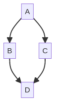

#+TITLE: mermaid layer
# Document tags are separated with "|" char
# The example below contains 2 tags: "layer" and "web service"
# Avaliable tags are listed in <spacemacs_root>/.ci/spacedoc-cfg.edn
# under ":spacetools.spacedoc.config/valid-tags" section.
#+TAGS: layer|web service

# The maximum height of the logo should be 200 pixels.

# TOC links should be GitHub style anchors.
* Table of Contents                                        :TOC_4_gh:noexport:
- [[#description][Description]]
- [[#description-1][Description]]
  - [[#features][Features:]]
- [[#install][Install]]
- [[#key-bindings][Key bindings]]
- [[#key-bindings-1][Key bindings]]

* Description
This layer adds support for something.
#+TAGS: dsl|layer|markup|programming

[[file:img/logo.svg]]

* Table of Contents                     :TOC_5_gh:noexport:
- [[#description][Description]]
  - [[#features][Features:]]
- [[#installation][Installation]]
- [[#key-bindings][Key bindings]]

* Description
This layer adds support for [[https://mermaid.js.org/][Mermaid]] diagrams to Spacemacs. Mermaid is
a JavaScript-based diagramming and charting tool that renders
Markdown-inspired text definitions to create and display diagrams.

For help with how to use Mermaid, see the [[https://mermaid.js.org/intro/getting-started][reference guide]].

The official file extension supported by this layer is =.mmd=. If you want something else,
set it in your =user-config= function of your =~/.spacemacs= file.

For example, the following diagram can be defined as follows:

#+BEGIN_SRC mermaid
  sequenceDiagram
      Server<<->>Client: Hello
#+END_SRC

** Features:
  - Autocomplete
  - Lint
  - Refactor
  - ...

* Install
To use this configuration layer, add it to your =~/.spacemacs=. You will need to
add =mermaid= to the existing =dotspacemacs-configuration-layers= list in this
file.

#+begin_src sh
npm install -g @mermaid-js/mermaid-cli --prefix ~/.local
#+end_src

* Key bindings

* Key bindings

| Key binding | Description                |
|-------------+----------------------------|
| ~SPC m c c~ | Compile Mermaid diagram    |
| ~SPC m c f~ | Compile Mermaid file       |
| ~SPC m c b~ | Compile Mermaid buffer     |
| ~SPC m c r~ | Compile Mermaid region     |
| ~SPC m c o~ | Open browser with diagram  |
| ~SPC m c d~ | Open Mermaid documentation |
